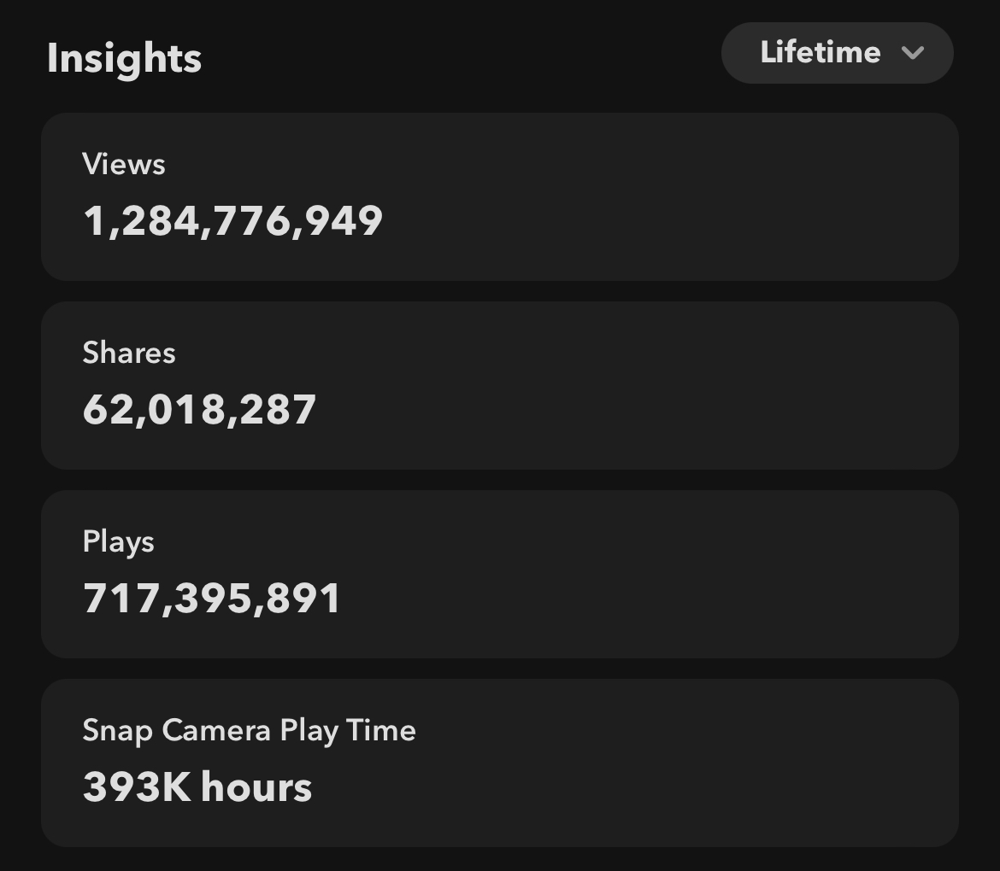

# AR-Projects

Welcome to the GitHub repository showcasing my journey in creating augmented reality filters for TikTok and Snapchat that have garnered over 3 billion views collectively. In this README, I will provide an overview of the project, share some key statistics, and provide guidance on how you can explore and contribute to this exciting venture.

## Project Overview
Augmented reality filters have taken social media platforms by storm, enhancing user engagement and providing endless fun. In this project, I have leveraged my creativity and technical skills to design and develop a series of unique and captivating filters for TikTok and Snapchat.

## Key Achievements
1. 3 Billion+ Views: Thanks to your support and enthusiasm, these filters have been viewed over 3 billion times, making them a viral sensation.

2. User Engagement: Users from all around the world have interacted with and enjoyed these filters, leading to increased user engagement and a broader audience.

3. Creativity Unleashed: These filters reflect a diverse range of creativity, from quirky animations to artistic overlays, ensuring there's something for everyone.

4. Collaboration: Collaboration with fellow creators, designers, and developers has been key to the project's success, fostering innovation and sharing knowledge.

## Current Statistics
### TikTok:

### Snapchat:

## Few Projects 

* Bloom Investing
* Corpse Mask
* Among Us
* Velocity Flash
